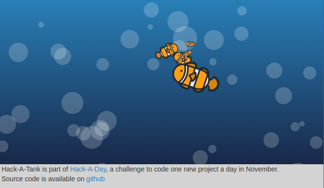

Hack-A-Day is a project I'm doing in November, where I try to make 30 new projects, in 30 days.

# Day 17: Hack-A-Sound

This is a fishtank.

Demo available [here](https://tilde.za3k.com/hackaday/tank).

Source available on [github](https://github.com/za3k/day17_tank).

## Credits
- Fish sprite from [Beksee](https://www.cleanpng.com/png-computer-icons-clip-art-clown-fish-3684590/).
- Ocean CSS from [Cody Pearce](https://freefrontend.com/css-water-effects/)
